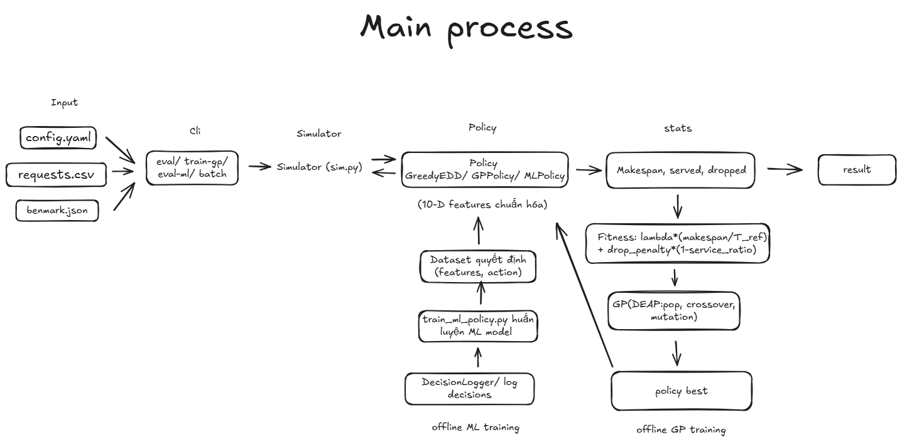

# Dynamic Truck-Drone Pickup Scheduling (GP-based)

Overview: event-driven simulator for dynamic pickup requests with time windows, mixed fleet (trucks + drones), capacity and waiting constraints. Genetic Programming evolves routing (R) and sequencing (S) rules. Default config fixes the waiting limit `Lw = 3600` (see `config.yaml`).

## Architecture



## Quick start

```bash
pip install -r requirements.txt

# baseline eval 1 instance
python -m src.cli eval --config config.yaml --clean-results

# train GP then eval 1 instance
python -m src.cli train-gp --config config.yaml --clean-results

# batch many instances
python -m src.cli batch --run-mode baseline --instances "6.*.*" --config config.yaml --clean-results
# or GP: --run-mode gp
```

## CLI modes

- `eval`: run baseline on one instance (`config.yaml` supplies `instance`, vehicles, `constraints.Lw`, `objective.lambda_w`, `gp.*`).
- `train-gp`: train GP on the instance then evaluate.
- `batch`: loop over instances (exact ids or glob), run baseline/GP, export summary CSV/JSON to `results/_batch` and compare tables to `results/_compare`. Use `--clean-results` to wipe per-instance outputs before each run.

## Config & data

- `config.yaml`: keys `instance`, `data_root`, `static_input_root`, `constraints.Lw` (default 3600), `objective.lambda_w`/`drop_penalty`, `gp.*`. Static vehicle/depot info is auto-applied from `inputs_static/<instance>.json` if present.
- Data: dynamic requests live under `data/raw/<instance>/requests.csv` (and optional `benchmark.json`), generated from `WithTimeWindows*` sources via `src/io_drive.py` scripts.

## Outputs

- Per run: `results/<instance>/` contains eval/train JSONs and benchmark comparison.
- Batch: `results/_batch/` summary CSV/JSON; `results/_compare/` served/dropped vs benchmark tables. Add `--clean-results` to avoid mixing old artifacts.

## Scripts

- Plot benchmark comparisons: `python scripts/plot_results.py --results-dir results --out-dir results/_plots`

## Model highlights

- Features (shared for R/S): dist_norm, demand_norm, rem_capacity_norm, demand_over_rc, nearest_next_norm, time_to_ready, time_to_due, waiting_time, drone_ok, is_drone (normalized by D_max/H/Q_max).
- Fitness: `lambda_w * (makespan / T_ref) + (1 - service_ratio)`, with T_ref from baseline makespan.
- Simulator: event-driven, per-vehicle queues; request assignment via R; next-customer selection via S; drops queue when no feasible choice to avoid deadlock.
