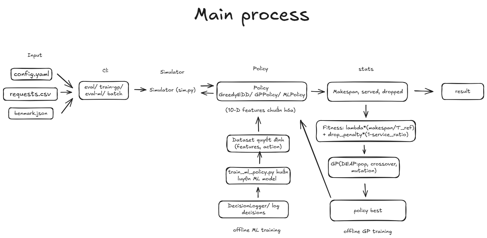

# Dynamic Truck‑Drone Pickup Scheduling (GP + baseline)

Event-driven simulator for dynamic pickup with time windows, mixed fleet (trucks + drones), capacity and waiting constraint `Lw`. Genetic Programming (GP) learns routing/selection rules; a deterministic baseline is available for eval/benchmarking.

## Architecture



## Quick start

```bash
pip install -r requirements.txt

# Baseline eval 1 instance (from config.yaml)
python -m src.cli eval --config config.yaml --clean-results

# Train GP then eval the same instance
python -m src.cli train-gp --config config.yaml --clean-results

# Batch many instances (baseline or GP)
python -m src.cli batch --run-mode baseline --instances "6.*.*" --config config.yaml --clean-results
python -m src.cli batch --run-mode gp       --instances "6.*.*" --config config.yaml --clean-results

# Research scripts (union Pareto / HV / plots / validation)
python scripts/run_benchmark.py   --config config.yaml --runs 10 --instances-dir WithTimeWindows --outdir results/my_benchmark --mode baseline
python scripts/run_benchmark.py   --config config.yaml --runs 3  --instances-dir WithTimeWindows --outdir results/my_benchmark_gp --mode gp
python scripts/validate_solution.py --file results/my_benchmark/output10.5.1.txt
python scripts/plot_solution.py     --file results/my_benchmark/output10.5.1.txt --out results/my_benchmark/plots/10.5.1.png
```

## CLI modes (src/cli.py)

- `eval`: run deterministic baseline on one instance. Uses `config.yaml` for `instance`, fleet, `constraints.Lw`, objective weights.
- `train-gp`: evolve GP on the instance, then evaluate best rule set.
- `batch`: loop over instances (list or glob), run baseline/GP, write per-instance JSON + comparison tables under `results/_batch` and `results/_compare`. `--clean-results` removes old outputs before each run.

## Research scripts

- `scripts/run_benchmark.py`: chạy nhiều run/instance, gom union-Pareto, tính Hypervolume với R = (1.05·max_Cmax, max_Unserved+1), xuất `table.tsv` và Pareto files `results/<tag>/output<instance>.txt`. `--mode baseline|gp`, `--runs`, `--instances-dir`, optional `--pattern` filter.
- `scripts/validate_solution.py`: parse file output*, kiểm tra tất cả ràng buộc (TW, Lw, capacity, drone_ok/range, no-duplicate), tính lại (Cmax, served, unserved).
- `scripts/plot_solution.py`: vẽ depot + khách, route truck (solid) / drone (dashed) cho một nghiệm trong file output.

## Output format (Pareto file)
```
SOLUTION k
OBJ Cmax=<float> Unserved=<int>
TRUCKS
T0: 0->5->7->0 | 0->9->0
T1: 0->3->0
DRONES
D0: 0->4->0
D1: 0->8->0
END
```
Nhiều nghiệm nối tiếp nhau. Parser chấp nhận thiếu drone/truck section (trống) nhưng phải có TRUCKS/DRONES/END.

## Config & data

- `config.yaml`: `instance`, `data_root`, `static_input_root`, `constraints.Lw` (mặc định 3600), `objective` (`lambda_w`, `drop_penalty`, weights), `gp.*` (pop, gens, stall_gens/eps, seed, seed_pairs). Static fleet/depot trong `inputs_static/<instance>.json` nếu tồn tại.
- Dữ liệu động: `data/raw/<instance>/requests.csv` (và tùy chọn `benchmark.json`). Có thể sinh từ thư mục WithTimeWindows qua `src/io_drive.py`.

## Simulator highlights

- Event-driven, tick 30s (configurable); state machine per vehicle (IDLE / EXECUTING_TRIP / WAITING_TO_DEPART); multi-trip allowed.
- Ràng buộc kiểm tra chặt: time window [e_i,l_i], capacity, Lw, drone fixed_time (nếu có), drone_ok.
- Budgets chống nổ runtime: `SIM_BUDGET_PER_TICK` (mặc định 250, có thể nâng cho bộ lớn), cap vị trí chèn/xe/loop; stall-guard cho opportunistic insert.
- Prefix cache + incremental simulate giảm số lần `_simulate_route`; early-stop khi tìm thấy chèn “đủ tốt”.
- Drop guard phân ba mức: PROVEN_INFEASIBLE (drop), UNCERTAIN (giữ pending), LIKELY_FEASIBLE (giữ).

## GP fitness (tóm tắt)

`F = lambda_w * (makespan / T_ref) + drop_penalty * (unserved / N)`, tối thiểu hóa. T_ref lấy từ baseline hoặc cấu hình.

## Outputs

- Per run: `results/<instance>/` chứa eval/train JSON và bảng so benchmark.
- Benchmark script: `results/<tag>/table.tsv` + `output<instance>.txt` (Pareto) + plots nếu chạy plot.

## Tips hiệu năng cho bộ lớn (50/100 khách)

- Tăng `SIM_BUDGET_PER_TICK` 400–600, `pull_from_pending_fast.cand_limit` 30–40, `max_sim_calls_pull` 220–260.
- Nới pre-check LB (due_lb) một chút và tăng audit false-negative nếu thấy nhiều `failed_ins_reason.due_lb`.
- Nếu pending đông, tăng trọng số tuổi trong score pending; giảm cooldown xuống 20–30s.

## Preset hiệu năng theo quy mô

| Quy mô instance | Gợi ý mô phỏng | Gợi ý GP |
| --- | --- | --- |
| Nhỏ (≤20 khách) | `SIM_BUDGET_PER_TICK=250`; `cand_limit=20`, `max_sim_calls_pull=180`; `veh_top_k=3`, `sim_budget=120`; emergency `sim_budget=220`; `decision_dt=30s` | `pop_size=150`, `generations=45`, `stall_gens=8`, `stall_eps=1e-4` |
| Trung bình (20–60) | `SIM_BUDGET_PER_TICK=400`; `cand_limit=30`, `max_sim_calls_pull=220`; `veh_top_k=5`, `sim_budget=180`; emergency `sim_budget=300`; `decision_dt=20–25s` | `pop_size=200`, `generations=60`, `stall_gens=12`, `stall_eps=1e-4` |
| Lớn (≥60–100) | `SIM_BUDGET_PER_TICK=550–600`; `cand_limit=40`, `max_sim_calls_pull=260`; `veh_top_k=6`, `sim_budget=220`; emergency `sim_budget=350`, victims top 6, vehicles top 5; `decision_dt=15–20s`; nới LB: `eta_lb*=0.97`, audit 3–5% | `pop_size=240–260`, `generations=70–80`, `stall_gens=20`, `stall_eps=1e-4`, giữ early-stop |

Chung: opportunistic req top 6–8, veh top 4–5, stall-guard 3 fail; backlog req 6–8, veh 8; cooldown mềm 20–30s (bỏ nếu `slack_lb` thấp); tăng weight `age` khi pending > 40% tổng req đã đến.
